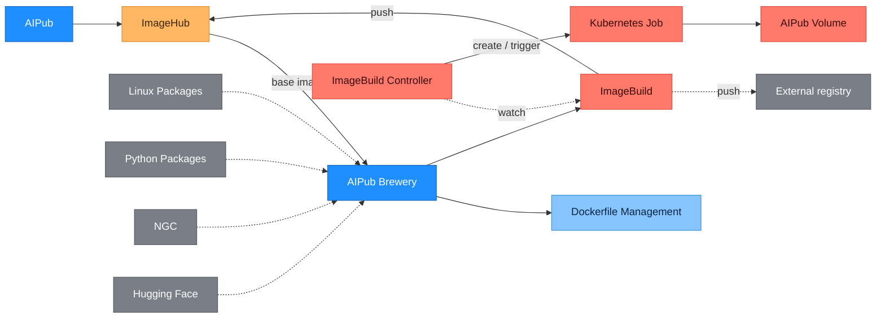

# Dockerizer PRD — Beta (AIPub 4.8.0)

> **핵심 가치 (One-liner):** Dockerizer는 고객이 다루는 **'이미지'라는 자산의 생성·관리·재사용 효율을 높이기 위해**, Dockerfile 작성부터 빌드·ImageHub 푸시·재활용까지 전 과정을 브라우저 안에서 끝낼 수 있게 한다.

| 항목 | 내용 |
|---|---|
| 문서 | Dockerizer 제품 요구사항 정의서 (PRD) |
| 범위 | **Beta** (AIPub 4.8.0 동반 출시) |
| 작성일 | 2026-05-29 |
| 출시 목표 | **AIPub 4.8.0 릴리즈와 함께 Beta 출시** — 목표일 2026-06-19 |
| 소스 | 서비스 기획서 v0.1 |
| 상태 | Draft |

---

## 1. 배경 · 문제 정의 (Why)

**한 줄 요약: 이미지는 ML 작업의 핵심 자산인데, AIPub에서 이미지 "생성(빌드)" 영역만 여전히 로컬에 묶여 있어 자산으로서 관리·재사용하기 어렵다.**

AIPub은 K8s 기반 ML 플랫폼으로 Workspace/Operation/Job 등 워크로드와 Harbor 기반 ImageHub를 제공하지만, 이미지 **생성(빌드)** 은 사용자 로컬 환경에 의존한다. 이로 인해:

- **로컬 환경 의존**: Dockerfile 수정 → 빌드 → 푸시 사이클을 매번 로컬에서 반복.
- **자산화 불가**: 개인 로컬에 흩어진 Dockerfile·이미지는 팀 단위 공유·재사용이 어려움.
- **재현성 저하**: 빌드 환경이 사람마다 달라 "내 로컬에선 되는데" 문제 발생.
- **리소스 비효율**: 수 GB~수십 GB ML 이미지가 로컬 디스크·네트워크 대역폭을 압박.
- **Workspace Commit 대체 필요**: 비권장 경로인 Workspace commit을 대체할 표준 이미지 생성 경로가 없음.

## 2. 비즈니스 기회 · 기대효과 (Why)

| 관점 | 기대효과 |
|---|---|
| **이미지 자산 효율** | 이미지의 생성·관리·재사용을 표준화해 자산으로서의 활용도를 높임 |
| 생산성 | 로컬 빌드/푸시 제거 → 이미지 생성 사이클 단축 |
| 협업성 | Project(namespace) 단위로 Dockerfile·이미지 자산 공유 |
| 표준화 | 기존 이미지 재활용으로 Workspace Commit을 대체하는 표준 경로 확보 |
| 인프라 활용 | 빌드를 k8s Job으로 수행 → 로컬 자원 부담을 클러스터로 이전 |

## 3. 목표 (Goals)

**핵심 목표 (Beta):** AIPub 4.8.0 Beta 출시 시점에, 사용자가 **Dockerizer로 이미지를 빌드**하고 그 **이미지로 워크로드(Workspace · Operation 등)를 정상적으로 구동**할 수 있음을 입증한다.

**정성 목표:**
- 고객의 '이미지' 자산을 생성·관리·재사용하는 **효율을 높인다.**
- 로컬 환경 없이 **브라우저만으로 이미지 빌드**가 가능함을 입증한다.
- 기존 ImageHub 이미지 재활용으로 **Workspace Commit을 대체**하는 표준 경로를 확보한다.

## 4. 페르소나

| 페르소나 | 구분 | 핵심 니즈 |
|---|---|---|
| ML 개발자 / 연구자 | **Primary** | 로컬 세팅 없이 학습·실험용 이미지를 만들어 Workspace/Job/Operation에 바로 사용 |
| 인프라 관리자 | Secondary | Project별 빌드 리소스·이미지 정책·보안 준수 관리 |

> Beta User Story는 Primary(ML 개발자) 중심으로 작성한다. 인프라 관리자용 정책/대시보드 기능은 대부분 Out-of-Scope(이후 TODO).

## 5. User Stories (Beta)

형식: **[페르소나]는 [목적]을 위해 [기능]을 원한다.**

- **US-1.** ML 개발자는 **로컬 세팅 없이 이미지를 설계하기 위해**, 브라우저 에디터에서 Dockerfile을 작성할 수 있어야 한다.
- **US-2.** ML 개발자는 **작업을 이어가고 팀과 공유하기 위해**, Dockerfile을 Project별로 저장·관리하고 다시 불러와 편집할 수 있어야 한다.
- **US-3.** ML 개발자는 **환경을 빠르게 구성하기 위해**, 기존 ImageHub 이미지나 NGC·Hugging Face 이미지를 base로 선택해 빌드할 수 있어야 한다.
- **US-4.** ML 개발자는 **학습 코드·데이터를 이미지에 포함하기 위해**, AIPub Volume을 빌드 컨텍스트로 사용할 수 있어야 한다.
- **US-5.** ML 개발자는 **이미지를 얻기 위해**, "빌드" 한 번으로 Kaniko 기반 빌드를 트리거할 수 있어야 한다.
- **US-6.** ML 개발자는 **진행 상황을 파악하기 위해**, 실시간 빌드 로그와 성공/실패 결과를 확인할 수 있어야 한다.
- **US-7.** ML 개발자는 **빌드한 이미지를 워크로드에 바로 쓰기 위해**, 빌드 성공 시 이미지가 Project의 ImageHub에 push되기를 원한다.
- **US-8.** 인프라 관리자는 **권한을 통제하기 위해**, Dockerfile·빌드·이미지 접근이 AIPub Project 권한 체계 내로 제한되기를 원한다.

## 6. 범위 (Scope)

### In-Scope (Beta)

- AIPub 유저 시스템 · Project · ImageHub 연동
- Project별 Dockerfile 생성·관리
- Dockerfile 작성 → 이미지 빌드 → ImageHub 푸시
- 기존 ImageHub 이미지를 base로 재활용한 빌드 (Workspace Commit 대체 경로)
- 외부 base 이미지 로드 — NGC, Hugging Face
- AIPub Volume을 빌드 컨텍스트로 활용

### Out-of-Scope (Beta 이후 TODO)

- Dockerfile 명령어 순서 모델링
- Project별 이미지 빌드 제한 설정
- Dockerfile syntax 등 입력 필드 검증
- 워크로드 파이프라인
- 워크로드(Workspace / Operation / Job) 이미지 사용처 표시
- Multi-stage 빌드 시각화
- 외부 레지스트리 Image Pull Secret 관리
- GitHub 연동
- Dockerfile 버전관리 (commit / diff / rollback)
- 보안 취약점 스캔

## 7. 인수 조건 (Acceptance Criteria)

Given-When-Then 구조. QA/개발이 이 조건으로 테스트 케이스를 도출할 수 있도록 작성.

- **AC-1 (Dockerfile 저장 — US-2)**
  - **Given** 유효한 Dockerfile을 작성한 상태에서
  - **When** 저장하면
  - **Then** `Project / User / 이름` 단위로 저장되고, 이후 목록 조회·재조회·재편집이 가능하다.
- **AC-2 (Base 이미지 선택 · 재활용 — US-3)**
  - **Given** Project가 접근 가능한 ImageHub / NGC / Hugging Face 이미지 목록에서
  - **When** 하나를 base 이미지로 선택해 빌드하면
  - **Then** 해당 base 이미지를 기반으로 빌드가 수행된다.
- **AC-3 (AIPub Volume 빌드 컨텍스트 — US-4)**
  - **Given** AIPub Volume을 빌드 컨텍스트로 지정한 상태에서
  - **When** 빌드를 실행하면
  - **Then** Volume의 파일이 빌드 컨텍스트로 전달되어 이미지에 반영된다.
- **AC-4 (빌드 트리거 — US-5)**
  - **Given** 빌드 가능한 Dockerfile에 대해
  - **When** "빌드"를 실행하면
  - **Then** `ImageBuild` CR이 생성되고 상태가 `Pending` → `Running`으로 진행된다.
- **AC-5 (빌드 성공 · push — US-7)**
  - **Given** 유효한 빌드가
  - **When** Kaniko에서 성공하면
  - **Then** 이미지가 해당 Project의 ImageHub에 push되고, CR status가 `Succeeded` + `imageDigest`로 갱신되며, UI에 푸시된 이미지 정보가 표시된다.
- **AC-6 (빌드 실패 진단 — US-6)**
  - **Given** 빌드가 실패한 경우
  - **When** 사용자가 결과를 확인하면
  - **Then** UI의 실시간/누적 로그로 실패 원인을 파악할 수 있고, CR status는 `Failed` + 사유(`message`)를 포함한다.
- **AC-7 (권한 — US-8)**
  - **Given** 어떤 Project에 권한이 없는 사용자가
  - **When** 그 Project의 Dockerfile·빌드·이미지에 접근을 시도하면
  - **Then** 접근이 거부된다.
- **AC-8 (워크로드 정상 구동 — ★ 핵심 목표)**
  - **Given** Dockerizer로 빌드·push된 이미지를
  - **When** AIPub 워크로드(Workspace · Operation 등)에서 사용하면
  - **Then** 정상적으로 pull·구동된다.

## 8. 제약 · 비기능 요구 (Constraints / NFR)

- **빌드 엔진 Kaniko 고정**: Docker daemon 불필요, rootless 실행(보안 이점), 레이어 기반 캐시 지원.
- **Base 이미지 출처**: 내부 ImageHub + 외부 레지스트리(NGC, Hugging Face).
- **빌드 컨텍스트**: AIPub Volume을 빌드 컨텍스트로 활용(학습 코드·데이터 포함).
- **인증 · 격리**: AIPub User/OIDC 인증, 빌드 Job은 해당 Project namespace에서 실행, 기존 `imagePullSecret` 체계 재사용.
- **선언적 빌드**: 빌드는 `ImageBuild` CR로 선언하고 컨트롤러가 Kaniko Job으로 수행하며 결과를 CR status에 반영(기존 AIPub CR 스타일과 일관).

## 9. 시스템 개요 (참고 — 상세 'How'는 실행계획 문서)

### 아키텍처 다이어그램

> 다이어그램의 **AIPub Brewery** 노드 = Dockerizer 서비스(리브랜드 전 명칭). 점선(`-.->`)은 watch/외부 소스·레지스트리 연동, 실선은 주 빌드 흐름.

### 구성요소

| 구성요소 | 역할 |
|---|---|
| **dockerizer-web** | Dockerfile 에디터, base 이미지 선택, 빌드 트리거, 결과/로그 조회 UI |
| **backend-server** | Dockerfile CRUD, `ImageBuild` CR 생성, 상태/로그 조회 (REST API, Swagger) |
| **imagebuild-controller** | `ImageBuild` CR watch → Kaniko Pod/Job 생성·관리 → CR status 갱신 |
| **Kaniko Job (Pod)** | 실제 이미지 빌드 및 ImageHub push |
| **ImageHub (Harbor)** | Base 이미지 제공 + 빌드 산출물 저장 |
| **외부 레지스트리** | NGC · Hugging Face — base 이미지 소스 |
| **AIPub Volume** | 빌드 컨텍스트(코드·데이터) 소스 |

**흐름:** 작성/저장 → `backend-server` 저장 → 빌드 Run → `ImageBuild` CR 생성 → `imagebuild-controller`가 Kaniko Job 기동(Base pull: ImageHub/NGC/HF, Context: AIPub Volume → build → push: ImageHub) → status/logs를 UI로 표시.

## 10. Open Questions (출시 전 결정 필요)

- **출시 일정**: AIPub 4.8.0 릴리즈(= Beta 동반 출시) 목표일 확정 — 현재 2026-06-19로 가정.
- **외부 이미지 인증**: NGC / Hugging Face 이미지 로드 시 인증 처리 — Beta는 공개 이미지/사전 구성 secret 사용? (per-Project Pull Secret 관리 UI는 이후 TODO)
- **AIPub Volume 컨텍스트 전달 방식**: 마운트 vs 복사, 접근 권한 처리.
- **태그 정책**: 사용자 자유 지정 vs 최소 규칙 강제(`latest` 금지 등).
- **빌드 노드 격리**: GPU 노드풀과 분리된 CPU 빌드 전용 노드풀 사용 여부.
- **Workspace Commit deprecate 시점**: 대체 플로우 안정화 이후로 보류.

## 11. 참고 문서

- 서비스 기획서 v0.1 — `dockerizer-web/CLAUDE.md`, `dockerizer-backend/CLAUDE.md`
- 백엔드 구조 — `dockerizer-backend/README.md`
- 실행계획 — `dockerizer-backend/docs/mvp-execution-plan.md`, `dockerizer-web/docs/mvp-execution-plan.md`
- K8s 연동 — `dockerizer-backend/docs/kubernetes-integration.md`, `dockerizer-web/docs/k8s-backend-integration.md`
